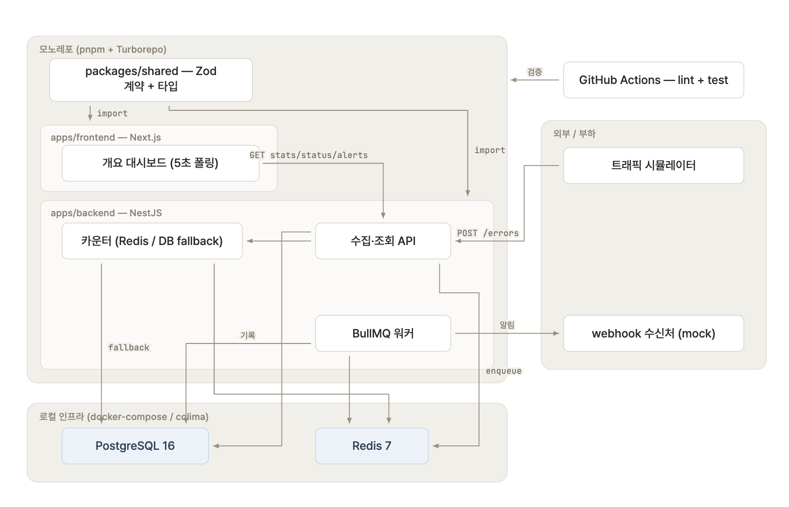

---

title: "[Incident Radar 0] 축소판 에러 모니터링 서버 만들기 — 개요"

description: 에러 모니터링 시스템을 직접 구현하며 구조와 동작 방식을 정리하는 개발 일지

pubDate: 2026-08-31

tags: [개발]

seriesOrder: 0

---

## 개요

여러 애플리케이션에서 에러가 발생하면 중앙 모니터링 서버로 에러 정보를 보고합니다.

서버는 앱별로 "최근 60초 동안 에러가 몇 건 발생했는지"를 실시간으로 집계하고, 임계값(기본 10건)을 넘으면 자동으로 알림을 발송합니다.

이 프로젝트에서 만드는 것은 에러를 수집하고 모니터링하는 쪽, 즉 중앙 에러 모니터링 서버입니다.

* **에러 건수 세기** — "최근 60초에 몇 건"처럼 계속 움직이는 시간 범위를 기준으로 에러를 집계해야 합니다. Redis의 정렬 자료구조를 사용해 오래된 기록은 제거하고 최근 기록만 집계합니다(슬라이딩 윈도우).

* **알림은 따로 처리하기** — 에러를 수집하는 API의 응답이 알림 발송 때문에 느려지면 안 되므로, 알림 작업은 큐에 넣고 백그라운드 워커가 처리합니다.

* **실패하면 재시도하기** — 알림 발송이 실패하면 재시도 간격을 점점 늘리면서 몇 차례 다시 시도합니다. 그래도 실패하면 실패 이력을 DB에 남깁니다(지수 백오프).

* **알림 쿨다운** — 한 서비스에서 에러가 계속 발생하면 같은 내용의 알림이 수십 번 발생할 수 있습니다. 한 번 알림을 보낸 서비스는 일정 시간 동안 다시 알림을 보내지 않습니다(`SET NX EX`).

* **Redis가 내려가도 동작하기** — 카운팅에 사용하는 Redis를 사용할 수 없으면 DB에서 에러 개수를 집계하는 방식으로 자동 전환합니다(fail-open).

* **기본기 챙기기** — DB 마이그레이션, 실제 DB·Redis를 연결한 테스트, CI, API 문서, 구조화 로그, 보안까지 함께 구성합니다.

## 화면

프론트엔드는 개요 대시보드 한 페이지로 구성합니다.

서비스별 에러 추이를 확인할 수 있는 라인 차트, 현재 cooldown 상태, 최근 알림 이력 테이블을 제공하며, 데이터는 5초 간격으로 폴링합니다.

## 스택

개발 과정에서 일부 기술 스택은 변경될 수 있습니다.

| 영역 | 기술 | 선택 이유 |
| --- | --- | --- |
| Monorepo | pnpm workspace · Turborepo | 백엔드·프론트·공유 패키지를 한 저장소에서 관리 |
| Backend | NestJS | 에러 수집·감지·알림·조회를 모듈 단위로 분리 |
| Database | PostgreSQL · TypeORM | 에러 이벤트와 알림 이력의 영속 저장 |
| Realtime / Cache | Redis · ioredis | Sliding Window 집계 + Cooldown 상태 관리 |
| Queue | BullMQ | 에러 수집과 webhook 알림을 비동기로 분리 |
| Validation | Zod | API 경계의 런타임 검증 + Backend/Frontend 스키마 공유 |
| Frontend | Next.js · Tailwind CSS · shadcn/ui | 설정 최소화로 대시보드 UI 구성 |
| Server State | TanStack Query | API 캐싱 + 5초 Polling |
| UI State | Zustand | 서버 데이터와 화면 상태 분리 |
| Chart | Recharts | 에러 추이 데이터를 간단하게 시각화 |
| Infra | Docker Compose | PostgreSQL + Redis 로컬 환경 통일 (맥은 colima) |
| Test | Jest · Supertest | 핵심 로직과 API 동작 검증 |
| CI | GitHub Actions | 커밋마다 테스트·빌드 자동 검증 |
| Shared | packages/shared | 요청·응답 스키마를 한 곳에 모아 Backend ↔ Frontend 정의 어긋남 방지 |

## 전체 구성도

시뮬레이터, webhook 수신처, BullMQ 워커, CI는 목표 구성에 포함되어 있습니다. 다만 현재 시점에서는 아직 구현하지 않은 부분도 있으며, 이후 각 편에서 기능을 하나씩 채워 나갈 예정입니다.

## 진행 방식

기능을 태스크(T1, T2, …) 단위로 잘게 나누고, 각 태스크마다 **작성 → 검증 → 커밋**을 반복합니다.

여기서 "검증"은 단순히 코드가 작성되었는지 확인하는 것이 아니라, 태스크의 성격에 맞는 최소한의 검증 과정을 통과했는지 확인하는 단계입니다.

기본적으로 아래 항목을 확인합니다.

* `pnpm turbo run typecheck` — 타입 에러 0개

* `pnpm turbo run lint` / `pnpm format:check` — 린트 및 포맷 검사 통과

* 로직이 있으면 유닛 테스트, 엔드포인트면 e2e 테스트 실행 — 실제 Postgres·Redis에 연결해서 검증

* API라면 추가로 `curl` 또는 `.http` 파일로 직접 요청을 보내 응답 확인
