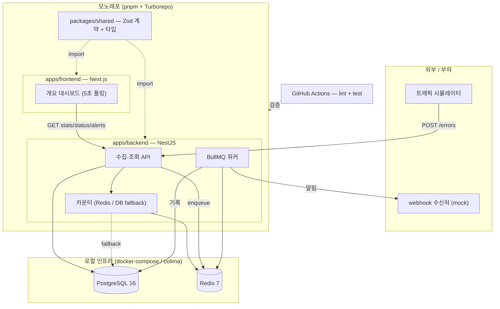

## 개요

 여러 애플리케이션이 에러가 날 때마다 중앙 모니터링 서버로
그 사실을 보고하고(`POST /errors`), 서버는 앱별로 "최근 60초 동안 에러가 몇 건인지"를 실시간으로
세다가 임계값(기본 10건)을 넘으면 자동으로 알림을 발송합니다.

이 프로젝트에서 만드는 건 에러를 받는 쪽, 즉 중앙 서버입니다.

- **에러 건수 세기** — "최근 60초에 몇 건"처럼 계속 움직이는 시간 창을 기준으로 세야 해서, Redis의 정렬 자료구조로 오래된 기록은 버리고 최근 것만 셉니다 (슬라이딩 윈도우).
- **알림은 따로** — 에러를 받는 응답이 알림 보내느라 느려지면 안 되니, 알림은 큐에 넣고 백그라운드 작업자가 처리합니다.
- **실패하면 재시도** — 알림 발송이 실패하면 간격을 점점 늘리며 몇 번 다시 시도하고, 그래도 안 되면 실패 이력을 DB에 남깁니다 (지수 백오프).
- **알림 쿨다운** — 한 서비스가 계속 에러를 쏟아내면 알림이 수십 번 터질 수 있습니다. 한 번 보내면 몇 분간 같은 서비스엔 다시 안 보냅니다 (`SET NX EX`).
- **Redis가 죽어도 동작** — 카운팅용 Redis가 내려가면 DB로 개수를 세는 쪽으로 자동 전환합니다 (fail-open).
- **기본기** — DB 마이그레이션, 실제 DB·Redis 붙여서 테스트, CI, API 문서, 구조화 로그, 보안.

## 화면

프론트는 개요 대시보드 한 페이지입니다. 서비스별 에러 추이 라인차트, 현재 cooldown 상태, 최근
알림 이력 테이블. 5초 폴링.

## 스택

개발하면서 바뀔 수 있습니다.

| 영역 | 스택 |
|---|---|
| 모노레포 | pnpm workspace + Turborepo |
| 백엔드 | NestJS · TypeORM · BullMQ · ioredis · Zod |
| 프론트 | Next.js (App Router) · Tailwind v4 · shadcn/ui · TanStack Query · Zustand · Recharts |
| 인프라 | PostgreSQL 16 · Redis 7 · Docker Compose (맥은 colima) |
| 테스트·CI | Jest · supertest · GitHub Actions |
| 공유 | `packages/shared` — Zod 스키마 + 타입을 백/프론트가 함께 import |

## 전체 구성도

시뮬레이터, webhook 수신처, BullMQ 워커, CI는 목표 구성입니다. 지금 시점에는 아직 안 만든
부분이 있고, 각 편에서 하나씩 채워 나갑니다.

## 진행 방식

기능을 태스크(T1, T2, …)로 잘게 쪼개서, 각 태스크마다 작성 → 검증 → 커밋을 반복합니다. "검증"은
태스크마다 최소한 이만큼 돌려서 초록인 걸 확인하는 겁니다.

- `pnpm turbo run typecheck` — 타입 에러 0
- `pnpm turbo run lint` / `pnpm format:check` — 린트·포맷 통과
- 로직이 있으면 유닛 테스트, 엔드포인트면 e2e 테스트 (둘 다 실제 Postgres·Redis에 붙여서)
- API면 추가로 `curl` 이나 `.http` 파일로 직접 때려보고 응답 확인

