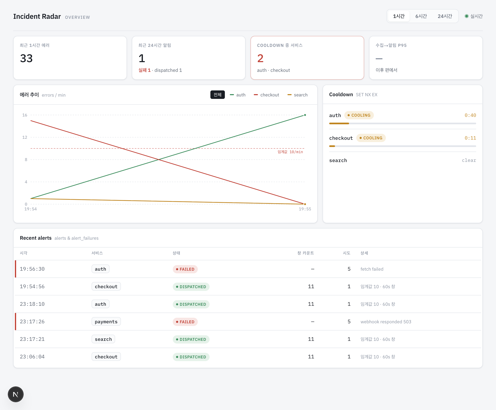
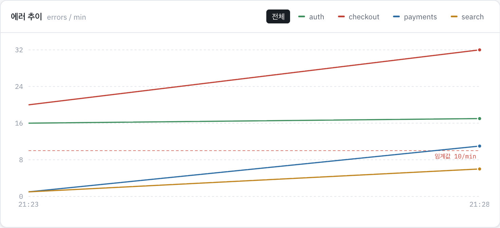
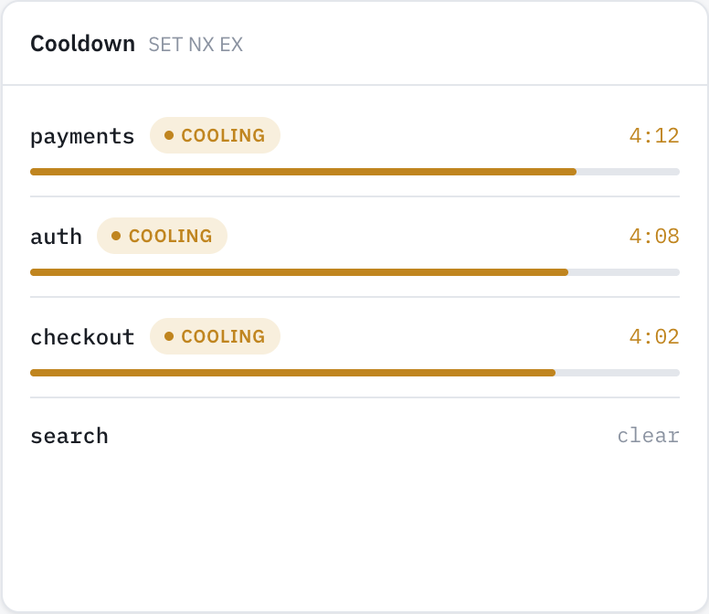
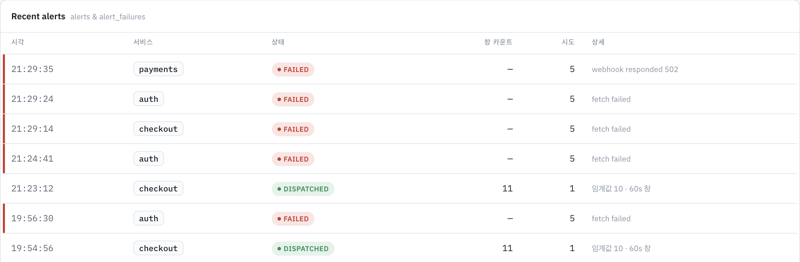

9편에서 API 호출·경계 검증·5초 폴링까지 데이터 계층을 만들었습니다.

이번 편에서는 그 위에 화면을 조립합니다. 레이아웃 셸과 스탯 타일 → 에러 추이 차트 → Cooldown 패널 → 최근 알림 테이블 → 화면 스타일 토큰 순서로 만들고, 데이터가 없거나 요청이 실패했을 때 각 패널이 어떻게 보이는지는 다음 편에서 다룹니다.

## 레이아웃과 스탯 타일

화면은 `page.tsx`에서 조립합니다.

```tsx
// apps/frontend/app/page.tsx
export default function Page() {
  return (
    <main className="mx-auto max-w-[1180px] px-[22px] pb-[60px] pt-[22px]">
      <TopBar />
      <StatTiles />
      <div className="mt-3 grid gap-3 lg:grid-cols-[1.9fr_1fr]">
        <TrendChart />
        <CooldownPanel />
      </div>
      <AlertsTable />
    </main>
  );
}
```



`TopBar`는 기간 선택(1시간/6시간/24시간, Zustand `rangeMinutes`)과 폴링 표시를 담당합니다.

```tsx
// apps/frontend/components/dashboard/top-bar.tsx (폴링 표시)
const fetching = useIsFetching() > 0;
// ...
<span
  role="status"
  aria-label={fetching ? "새로고침 중" : "대기 중"}
  className="h-1.5 w-1.5 rounded-full bg-ok [animation:poll-pulse_2.4s_ease-out_infinite] motion-reduce:[animation:none]"
/>
```

`StatTiles`는 최근 에러 수, 최근 24시간 알림(발송/실패), cooldown 중인 서비스 수 네 칸을 보여줍니다(네 번째 칸은 지연 데이터가 아직 없어 "이후 편에서" 자리표시자). 계산은 컴포넌트가 아니라 `lib/tiles.ts`의 순수 함수가 합니다.

```ts
// apps/frontend/lib/tiles.ts
export function recentErrorCount(stats: StatsResponse | undefined): number {
  return stats ? totalErrorsInRange(stats) : 0;
}

export function alertCounts(
  alerts: Alert[] | undefined,
  sinceMs?: number,
): { dispatched: number; failed: number } {
  const acc = { dispatched: 0, failed: 0 };
  for (const a of alerts ?? []) {
    if (sinceMs !== undefined && Date.parse(a.at) < sinceMs) continue;
    if (a.status === "dispatched") acc.dispatched += 1;
    else acc.failed += 1;
  }
  return acc;
}

export function cooldownServiceCount(status: ServiceStatus[] | undefined): number {
  return (status ?? []).filter((s) => s.cooldownActive).length;
}
```

컴포넌트는 이 함수들의 반환값만 그리므로, 렌더링 테스트 없이 함수 자체를 유닛 테스트 7개(빈 데이터 처리 3개, `alertCounts`의 `sinceMs` 필터, 나머지 집계)로 확인했습니다.

## 에러 추이 차트

`/stats` 응답은 서비스별로 나뉜 배열입니다. recharts에 그대로 넘길 수 없어, `pivotStats`가 시각 × 서비스 격자로 피벗합니다.

```ts
// apps/frontend/lib/chart.ts
export function pivotStats(stats: StatsResponse): { rows: ChartRow[]; services: string[] } {
  const services = stats.map((s) => s.service).sort();
  const byTime = new Map<string, ChartRow>();
  for (const series of stats) {
    for (const b of series.buckets) {
      let row = byTime.get(b.t);
      if (!row) {
        row = { t: b.t };
        for (const svc of services) row[svc] = 0;
        byTime.set(b.t, row);
      }
      row[series.service] = b.count;
    }
  }
  const rows = [...byTime.values()].sort((a, b) => a.t.localeCompare(b.t));
  return { rows, services };
}
```

서비스가 특정 버킷에 에러가 없으면 그 칸을 0으로 미리 채웁니다. 채우지 않으면 recharts가 데이터 없는 구간에서 선을 끊어 버립니다.

이렇게 채운 데이터를 recharts로 그립니다.

```tsx
// apps/frontend/components/dashboard/trend-chart.tsx (일부)
<ReferenceLine
  y={ALERT_THRESHOLD}
  stroke="#c14338"
  strokeDasharray="4 3"
  label={{ value: `임계값 ${ALERT_THRESHOLD}/min`, position: "insideTopRight" }}
/>
{services.map((s, i) => (
  <Line
    key={s}
    type="linear"
    dataKey={s}
    stroke={colorFor(s, i)}
    isAnimationActive={false}
  />
))}
```



서비스별 색은 참고 목업과 맞춘 고정 매핑(checkout/payments/auth/search)이고, 이 색은 서비스 필터 버튼의 스와치로도 씁니다. 필터를 누르면 Zustand `service`가 바뀌고 `useStats`가 그 서비스만 다시 요청합니다.

`pivotStats`는 유닛 테스트 3개(빈 응답, 버킷 병합과 빈 칸 채우기, 시각 정렬)로 확인했습니다.

## Cooldown 패널

9편에서 만든 `cooldownRemaining`으로 `/status`의 서비스별 cooldown 잔여 TTL을 화면용 행으로 만듭니다.

```ts
// apps/frontend/lib/cooldown.ts
export function cooldownRows(
  status: ServiceStatus[] | undefined,
  fetchedAtMs: number,
  nowMs: number,
  fullSec: number,
): CooldownRow[] {
  const rows: CooldownRow[] = (status ?? []).map((s) => {
    const remainingSec = cooldownRemaining(s.cooldownTtlSec, fetchedAtMs, nowMs);
    const active = remainingSec !== null && remainingSec > 0;
    const pct = active ? Math.min(100, Math.max(0, (remainingSec / fullSec) * 100)) : 0;
    return { service: s.service, active, remainingSec: remainingSec ?? null, pct };
  });
  return rows.sort((a, b) => {
    if (a.active !== b.active) return a.active ? -1 : 1;
    if (a.active) return (b.remainingSec ?? 0) - (a.remainingSec ?? 0);
    return a.service.localeCompare(b.service);
  });
}
```

활성인 서비스를 잔여 시간 내림차순으로 먼저 두고, 나머지는 이름순으로 뒤에 둡니다. `pct`는 진행 바 채움 비율입니다.

`cooldownRemaining`은 폴링 시점의 TTL만 갖고 있어서, 5초 사이 값을 매끄럽게 줄이려면 화면에서 별도로 시각을 갱신해야 합니다. `CooldownPanel`은 1초마다 로컬 시각을 갱신하는 타이머를 둡니다.

```tsx
// apps/frontend/components/dashboard/cooldown-panel.tsx (일부)
const [now, setNow] = useState(() => Date.now());
useEffect(() => {
  const id = setInterval(() => setNow(Date.now()), 1000);
  return () => clearInterval(id);
}, []);
const rows = cooldownRows(status.data, status.dataUpdatedAt, now, COOLDOWN_SEC);
```



`cooldownRows`는 유닛 테스트 5개(빈 데이터, 정렬 순서, 경과 시간 보간, 만료 시 `active=false`, `pct` 100 클램프)로 확인했습니다.

## 최근 알림 테이블

`Alert`는 판별 유니온이라, `alertRow`가 `status`에 따라 다른 필드를 채웁니다.

```ts
// apps/frontend/lib/alerts-table.ts
export function alertRow(a: Alert): AlertRow {
  const base = {
    id: a.id,
    time: fmtTime(a.at),
    service: a.service,
    status: a.status,
    failed: a.status === "failed",
  };
  if (a.status === "dispatched") {
    return {
      ...base,
      windowCount: String(a.count),
      attempts: "1",
      detail: `임계값 ${a.threshold} · ${a.windowMs / 1000}s 창`,
    };
  }
  return {
    ...base,
    windowCount: "—",
    attempts: String(a.attempts),
    detail: a.error,
  };
}
```

`dispatched`는 창 카운트와 임계값을, `failed`는 시도 횟수와 에러 메시지를 상세 칸에 보여줍니다. 실패 행은 왼쪽에 빨간 세로선을 붙여 구분합니다.



테이블에는 `aria-live` 안내 영역도 둡니다.

```tsx
// apps/frontend/components/dashboard/alerts-table.tsx (일부)
const topId = alerts.data?.[0]?.id;
const prevTopId = useRef<string | undefined>(undefined);
const [announce, setAnnounce] = useState("");
useEffect(() => {
  if (topId && prevTopId.current !== undefined && topId !== prevTopId.current) {
    setAnnounce(latestAlertLabel(alerts.data));
  }
  prevTopId.current = topId;
}, [topId, alerts.data]);
```

`prevTopId`를 처음엔 `undefined`로 둬서, 첫 로드에서 알림이 여러 건 한꺼번에 들어왔을 때는 안내하지 않습니다. 이후 폴링에서 맨 앞 알림이 바뀔 때만 `aria-live="polite"` 영역에 `latestAlertLabel`이 만든 "새 알림: {서비스} {발송됨|발송 실패}" 형태의 문구가 나타납니다.

`alertRow`와 `latestAlertLabel`은 유닛 테스트 5개(dispatched/failed 필드 분기, 시각 포맷, 안내 문구 빈 값과 정상 값)로 확인했습니다.
