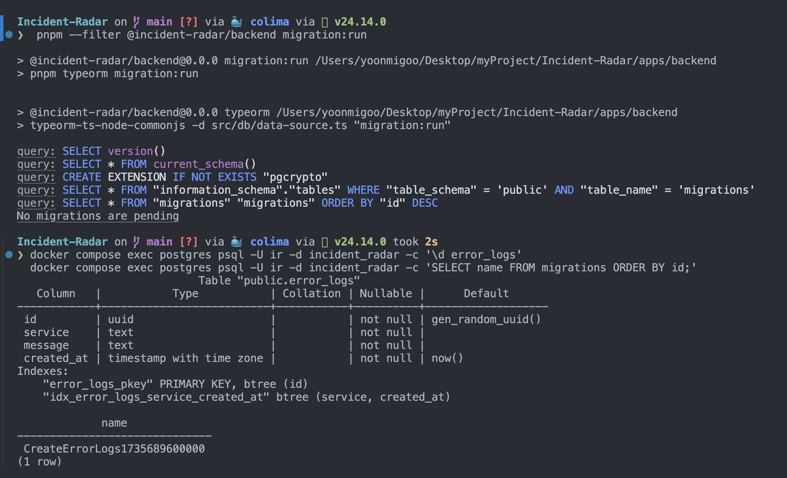
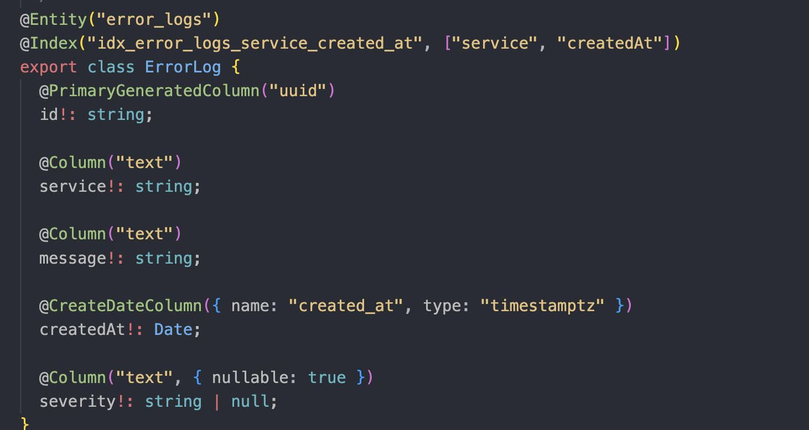
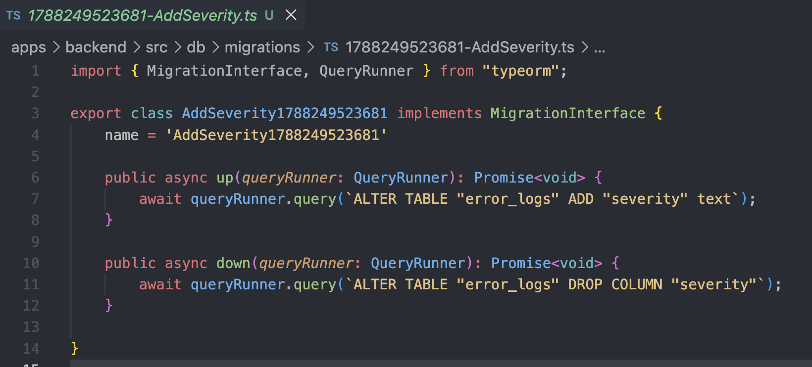
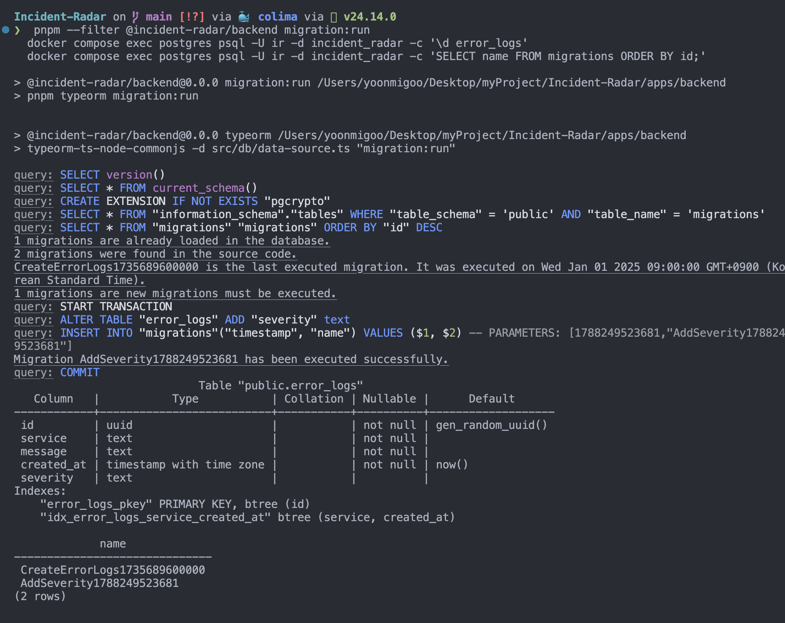
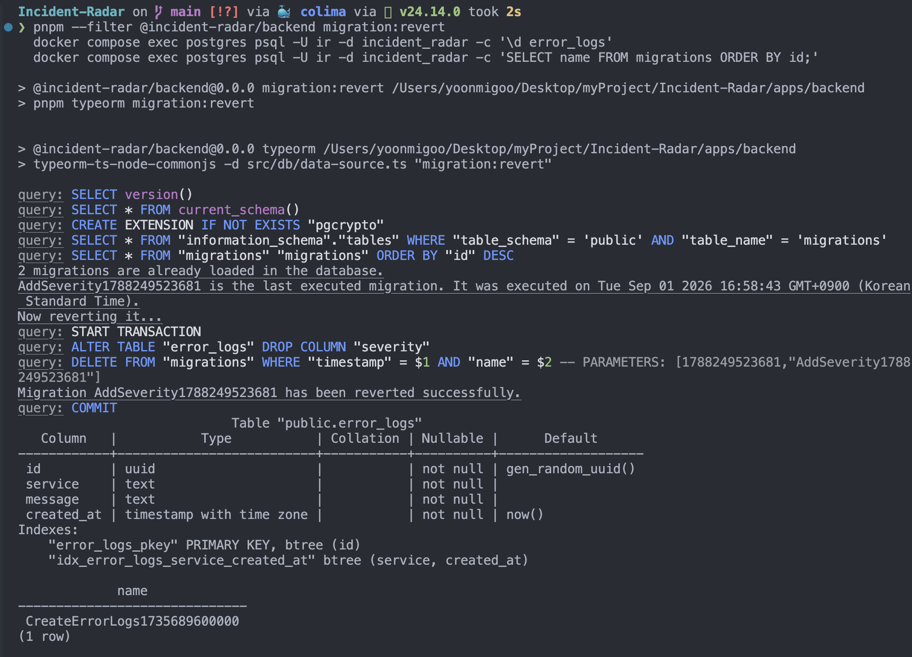
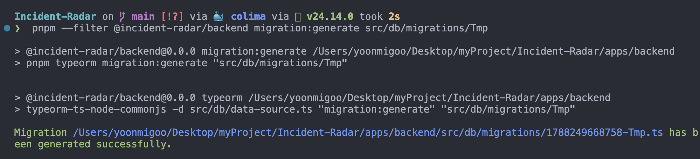

---

title: "[Incident Radar 3] synchronize: false — TypeORM 마이그레이션으로만 스키마 바꾸기"

description: synchronize를 끄고 스키마 변경을 전부 마이그레이션 파일로 관리한 이유와 작업 흐름. 개발에서도 끄기로 한 결정 포함.

pubDate: 2026-09-01

tags: [개발]

seriesOrder: 3

---

2편에서 세운 TypeORM 연결 위에서 첫 테이블인 `error_logs`를 만들면서 정한 규칙을 정리합니다.

이 프로젝트에서는 개발 환경을 포함해 DB 스키마 변경을 `synchronize`에 맡기지 않고, 모두 마이그레이션 파일로 관리합니다.

이 글에서는 먼저 `synchronize: true`가 어떤 문제를 만들 수 있는지 살펴보고, 왜 `synchronize: false`를 선택했는지 정리합니다.

그다음 마이그레이션이 실제로 어떤 순서로 동작하는지 확인하고, `error_logs`에 `severity` 컬럼을 추가했다가 되돌리는 과정을 직접 실행해봅니다.

전체 흐름은 다음과 같습니다.

```text
엔티티 수정
    ↓
migration:generate
    ↓
변경 내용을 마이그레이션 파일로 생성
    ↓
생성된 SQL 확인
    ↓
migration:run
    ↓
DB 스키마 변경
    ↓
migration:revert
    ↓
마지막 마이그레이션 되돌리기
```

여기서 `migration:generate`, `migration:run`, `migration:revert`는 NestJS 애플리케이션을 실행하는 명령이 아니라 TypeORM CLI가 실행하는 명령입니다.

따라서 CLI가 DB 연결 정보와 엔티티, 마이그레이션 파일의 위치를 알 수 있도록 별도의 `DataSource` 설정을 사용합니다. 이 부분은 마이그레이션 흐름을 설명하면서 함께 살펴봅니다.

## synchronize: true가 하는 일

TypeORM의 `synchronize: true`는 앱이 부팅할 때마다 엔티티 클래스를 기준으로 DB 스키마를 자동으로 맞춥니다.

초기 개발에서는 편하지만, 스키마 변경을 직접 통제하기 어렵다는 문제가 있습니다.

* 컬럼 이름 변경처럼 스키마 변경 과정에서 기존 컬럼을 제거하고 새로 만드는 방식이 발생할 수 있습니다. 이 경우 데이터가 유실될 위험이 있습니다.

* 변경 이력이 별도의 마이그레이션 파일로 남지 않습니다. 무엇이 언제 왜 변경됐는지 변경 자체를 명시적으로 관리하기 어렵고, 되돌리는 작업도 별도로 제어해야 합니다.

* 인덱스나 enum처럼 DB별 특성이 있는 스키마 변경은 자동 동기화만으로 의도를 명확하게 관리하기 어렵습니다.

* 데이터 백필처럼 "스키마를 변경한 뒤 기존 데이터를 새로운 규칙에 맞게 수정하는 작업"을 변경 과정에 명시적으로 넣기 어렵습니다.

그래서 이 프로젝트에서는 개발 환경을 포함해 스키마 변경을 `synchronize`에 맡기지 않고, 마이그레이션 파일로만 관리합니다.

```ts
// apps/backend/src/app.module.ts

TypeOrmModule.forRootAsync({
  inject: [ConfigService],
  useFactory: (config: ConfigService<Env, true>) => ({
    type: "postgres",
    url: config.get("DATABASE_URL", { infer: true }),
    entities,
    synchronize: false,
    migrationsRun: false,
    uuidExtension: "pgcrypto",
  }),
});
```

## 마이그레이션 CLI는 어떤 설정을 사용할까?

앞에서 `migration:generate`나 `migration:run` 같은 명령을 사용한다고 했습니다.

그런데 이 명령들은 NestJS 애플리케이션을 실행하지 않고 TypeORM CLI가 직접 실행합니다.

그러면 TypeORM CLI는 어떻게 DB가 어디에 있는지, 어떤 엔티티를 비교해야 하는지, 마이그레이션 파일은 어디에 있는지를 알 수 있을까요?

이 정보를 담아두는 것이 `DataSource`입니다.

쉽게 말하면 `DataSource`는 **TypeORM이 DB 작업을 하기 위해 필요한 설정을 모아둔 객체**입니다.

이 프로젝트에서는 TypeORM을 사용하는 상황이 두 가지입니다.

```text
① NestJS 서버 실행
   ↓
AppModule의 TypeORM 설정
   ↓
PostgreSQL 연결


② migration:generate / run / revert 실행
   ↓
TypeORM CLI
   ↓
data-source.ts
   ↓
PostgreSQL 연결
```

서버를 실행할 때는 `AppModule`의 TypeORM 설정을 사용합니다.

반면 마이그레이션 CLI는 NestJS 애플리케이션을 부팅하지 않기 때문에 별도의 `DataSource` 설정이 필요합니다.

```ts
// apps/backend/src/db/data-source.ts

loadEnv({ path: [".env", "../../.env"] });

export const AppDataSource = new DataSource({
  type: "postgres",
  url: process.env.DATABASE_URL,
  entities,
  migrations: [__dirname + "/migrations/*.{ts,js}"],
  synchronize: false,
  uuidExtension: "pgcrypto",
  logging: ["error", "warn", "migration"],
});
```

여기서 중요한 설정은 다음과 같습니다.

* `url` — 어느 DB에 연결할지
* `entities` — 어떤 엔티티를 기준으로 스키마를 비교할지
* `migrations` — 마이그레이션 파일이 어디에 있는지

예를 들어 `ErrorLog` 엔티티에 `severity` 컬럼을 추가한 뒤 `migration:generate`를 실행하면, CLI는 이 `DataSource`를 통해 `ErrorLog` 엔티티와 현재 PostgreSQL의 `error_logs` 테이블을 확인하고 그 차이를 마이그레이션 파일로 만들어냅니다.

런타임(`app.module.ts`)과 CLI(`data-source.ts`)에서 엔티티 목록을 각각 따로 관리하면 두 설정이 서로 다른 엔티티를 바라볼 수 있습니다.

그래서 엔티티 목록은 한 곳에서 관리하고 양쪽에서 import합니다.

```ts
// apps/backend/src/db/entities/index.ts

export const entities = [ErrorLog];
```

## 마이그레이션 파일

마이그레이션은 타임스탬프가 붙은 `up()` / `down()` 한 쌍으로 구성됩니다.

`up()`은 변경을 적용하고, `down()`은 해당 변경을 되돌립니다.

마이그레이션이 실행되면 TypeORM의 `migrations` 테이블에 적용 이력이 기록되므로, 이미 적용된 마이그레이션이 다시 실행되지 않습니다.

```ts
export class CreateErrorLogs1735689600000 implements MigrationInterface {
  name = "CreateErrorLogs1735689600000";

  public async up(q: QueryRunner): Promise<void> {
    await q.query(`
      CREATE TABLE "error_logs" (
        "id" uuid PRIMARY KEY DEFAULT gen_random_uuid(),
        "service" text NOT NULL,
        "message" text NOT NULL,
        "created_at" timestamptz NOT NULL DEFAULT now()
      )
    `);

    await q.query(`
      CREATE INDEX "idx_error_logs_service_created_at"
      ON "error_logs" ("service", "created_at")
    `);
  }

  public async down(q: QueryRunner): Promise<void> {
    await q.query(`DROP INDEX "idx_error_logs_service_created_at"`);

    await q.query(`DROP TABLE "error_logs"`);
  }
}
```

`migration:generate`를 사용하면 엔티티와 현재 DB 스키마를 비교해 마이그레이션 SQL을 생성할 수 있습니다.

다만 생성 결과를 그대로 신뢰하지 않고, 생성된 파일을 직접 열어 예상하지 못한 `DROP`이나 위험한 변경이 포함되어 있지 않은지 확인합니다.

## 스키마 변경 흐름

스키마 변경은 다음 순서로 진행합니다.

1. 엔티티를 수정합니다.

2. `pnpm --filter @incident-radar/backend migration:generate src/db/migrations/<이름>`

3. 생성된 마이그레이션 파일을 확인합니다. `DROP` 같은 데이터 유실 가능성이 있는 변경이 있다면 의도한 변경인지 판단합니다.

4. `pnpm --filter @incident-radar/backend migration:run`

5. 엔티티 수정과 마이그레이션 파일을 같은 커밋에 포함합니다.

아래는 위 흐름을 `error_logs`에 `severity` 컬럼을 추가했다가 되돌리는 방식으로 실제 실행한 기록입니다.

스키마 상태는 실행 중인 Postgres 컨테이너 안에서 `psql`로 확인합니다.

```bash
docker compose exec postgres psql -U ir -d incident_radar -c '\d error_logs'

docker compose exec postgres psql -U ir -d incident_radar -c 'SELECT name FROM migrations ORDER BY id;'
```

`docker compose exec postgres`는 `docker-compose.yml`의 `postgres` 컨테이너 안에서 명령을 실행합니다.

`psql`의 `-c` 옵션은 지정한 SQL이나 메타 명령을 실행한 뒤 종료합니다.

`\d error_logs`는 테이블의 컬럼, 기본값, 인덱스 등의 구조를 보여주고, `migrations` 조회는 현재까지 적용된 마이그레이션 목록을 보여줍니다.

### 1. baseline

`migration:run`으로 `CreateErrorLogs`를 적용한 상태입니다.

`\d error_logs`에는 컬럼 4개(`id`, `service`, `message`, `created_at`)와 인덱스 2개가 있고, `migrations` 테이블에는 한 행이 있습니다.



### 2. 엔티티에 컬럼 추가

```ts
@Column("text", { nullable: true })
severity!: string | null;
```



### 3. migration:generate

엔티티와 현재 DB 스키마를 비교해 마이그레이션 파일을 생성합니다.

`up()`에는 `ALTER TABLE "error_logs" ADD "severity" text`, `down()`에는 `DROP COLUMN "severity"`가 생성됩니다.

생성된 SQL을 열어 예상하지 못한 `DROP`이나 데이터 유실 가능성이 있는 변경이 없는지 먼저 확인합니다.



### 4. migration:run

`START TRANSACTION` → `ALTER TABLE ... ADD "severity"` → `migrations` 테이블에 행 INSERT → `COMMIT` 순으로 실행됩니다.

`\d error_logs`에는 `severity | text` 컬럼이 추가됩니다. nullable이고 기본값은 없습니다.

`migrations` 테이블에는 baseline인 `CreateErrorLogs`와 방금 실행한 `AddSeverity` 두 행이 남습니다.



### 5. migration:revert

마지막으로 적용된 마이그레이션 하나인 `AddSeverity`를 되돌립니다.

`ALTER TABLE ... DROP COLUMN "severity"`를 실행하고, `migrations` 테이블에서 `AddSeverity`에 해당하는 행을 삭제합니다.

이후 `\d error_logs`는 다시 컬럼 4개가 되고, `migrations` 테이블에는 `CreateErrorLogs` 한 행만 남습니다.



### 6. generate의 비교 대상

엔티티에 `severity`를 남겨둔 채 DB만 revert된 상태에서 `migration:generate`를 다시 실행하면, 엔티티에는 있고 DB에는 없으므로 `ADD "severity"` 변경을 다시 생성합니다.

반대로 엔티티에서도 `severity`를 제거한 상태라면 현재 엔티티와 DB 스키마 사이에 차이가 없으므로 `No changes in database schema`로 끝납니다.

즉, `migration:generate`가 비교하는 대상은 **소스 코드의 엔티티와 현재 DB 스키마**입니다.



## 복합 인덱스 (service, created_at)

이 서비스의 주요 조회는 "특정 서비스의 특정 시간 범위 에러"입니다. `GET /errors`(5편)가 이 형태이고, 이후 Redis 장애 시 DB로 개수를 세는 fallback도 같은 패턴입니다.

이를 위해 `(service, created_at)` 복합 인덱스를 둡니다.

복합 인덱스는 일반적으로 선두 컬럼부터 조건에 활용하는 조회 패턴에서 효과적입니다.

이 프로젝트에서는 먼저 `service`로 대상을 좁히고, 그 결과 안에서 `created_at`의 시간 범위를 조회합니다.

즉, 다음과 같은 조회 패턴에 맞춘 순서입니다.

```sql
WHERE service = 'checkout'
  AND created_at >= :from
ORDER BY created_at DESC
```

인덱스를 `(service, created_at)` 순서로 두면 먼저 특정 서비스의 범위를 좁힌 뒤 그 안에서 시간 범위를 탐색할 수 있습니다.

반대로 `(created_at, service)`로 순서를 뒤집으면 현재 프로젝트의 주요 조회 패턴과 인덱스 구조가 맞지 않아 `service`를 기준으로 먼저 좁히는 접근을 그대로 활용하기 어렵습니다.
