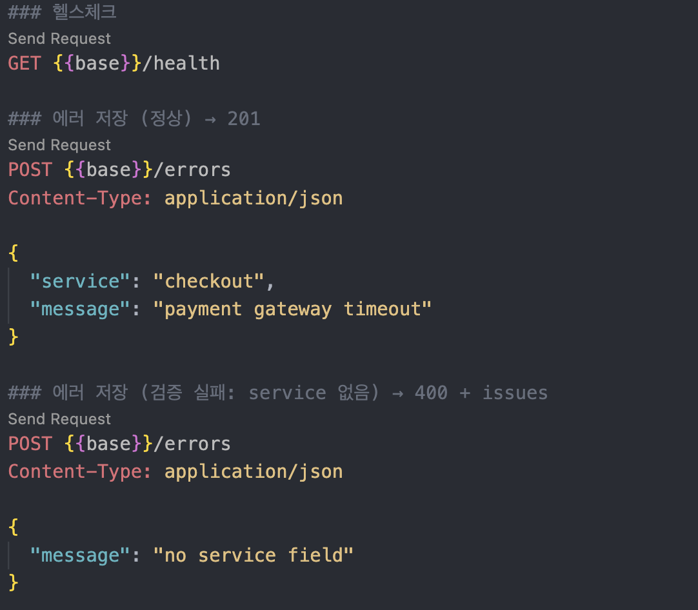
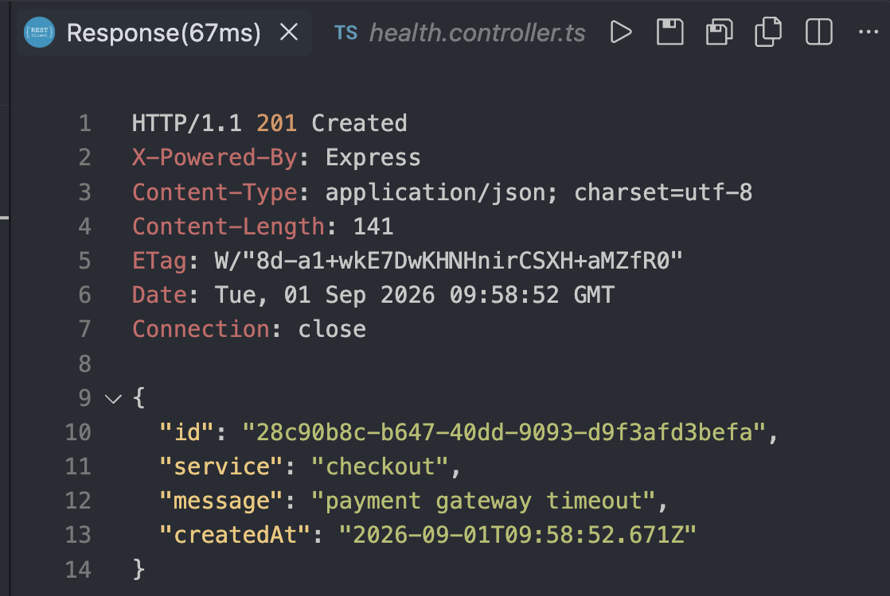
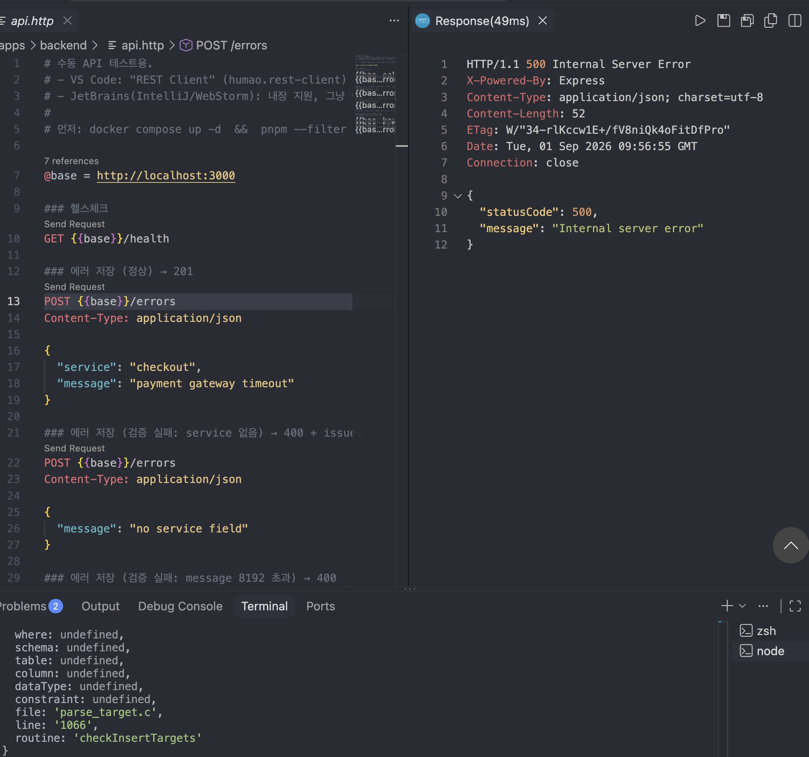

3편에서는 DB 스키마를 마이그레이션으로 관리하는 규칙을 정했고, 4편에서는 실제 Postgres·Redis에 연결하는 테스트 환경을 구성했습니다.

이제 그 위에 첫 기능을 구현합니다.

이번 편에서는 에러를 받아 저장하고 조회하는 `POST /errors`, `GET /errors`와 서비스별로 "최근 60초 동안 에러가 몇 건 발생했는지" 세는 슬라이딩 윈도우 카운터를 만듭니다.

두 기능은 이후 알림 로직에서 함께 사용하지만, 이번 글에서는 각각의 구현과 검증에 집중합니다.

## API 요청 처리 흐름

먼저 API 요청이 저장되기까지의 흐름은 다음과 같습니다.

```text
HTTP 요청 (POST /errors, GET /errors)
  ↓
Zod 검증 Pipe
  ↓
Controller (ErrorsController)
  ↓
Service (ErrorsService)
  ↓
Repository
  ↓
DB (PostgreSQL)
```

NestJS에서는 요청이 컨트롤러 핸들러에 도달하기 전에 Pipe를 거칠 수 있습니다.

Pipe에서 요청값 검증에 실패하면 컨트롤러 핸들러는 실행되지 않습니다. 따라서 입력 검증을 Pipe에 두면 컨트롤러 이후의 코드에서는 항상 검증된 값만 다룰 수 있습니다.

## Zod 검증 Pipe

Pipe는 핸들러가 실행되기 전에 값을 검증하거나 변형하는 NestJS의 구성 요소입니다.

`PipeTransform` 인터페이스의 `transform()`을 구현하면 됩니다.

`safeParse()`가 실패하면 `BadRequestException`을 던져 400 응답과 함께 어떤 필드가 왜 잘못됐는지 반환합니다. 검증에 성공하면 `result.data`를 반환하고, 이후 코드에서는 검증된 타입의 값을 사용할 수 있습니다.

```ts
// apps/backend/src/common/zod-validation.pipe.ts
export class ZodValidationPipe<T> implements PipeTransform {
  constructor(private readonly schema: ZodType<T>) {}

  transform(value: unknown): T {
    const result = this.schema.safeParse(value);
    if (!result.success) {
      throw new BadRequestException({
        message: "요청 검증 실패",
        issues: result.error.issues.map((i) => ({
          path: i.path.join(".") || "(root)",
          message: i.message,
        })),
      });
    }
    return result.data;
  }
}
```

이 Pipe에는 `@Injectable()`을 붙이지 않았습니다. Nest DI가 관리하는 대신, 컨트롤러에서 스키마를 넘겨 `new ZodValidationPipe(schema)`로 직접 생성하기 때문입니다.

```ts
// apps/backend/src/errors/errors.controller.ts
@Controller("errors")
export class ErrorsController {
  constructor(private readonly errors: ErrorsService) {}

  @Post()
  create(@Body(new ZodValidationPipe(ErrorLogInput)) body: ErrorLogInput) {
    return this.errors.create(body);
  }

  @Get()
  find(@Query(new ZodValidationPipe(ErrorsQuery)) query: ErrorsQuery) {
    return this.errors.find(query);
  }
}
```

`ErrorLogInput`은 1편에서 만든 `packages/shared`의 Zod 스키마를 그대로 가져와 요청 본문 검증에 사용합니다. 백엔드가 이 공유 스키마를 실제로 쓰는 첫 사용처입니다.

## POST /errors — 저장

`@Post()`는 Nest에서 기본 응답 상태 코드로 201을 사용합니다.

```ts
// apps/backend/src/errors/errors.service.ts
create(input: ErrorLogInput): Promise<ErrorLog> {
  return this.repo.save(this.repo.create(input));
}
```

`repo.create(input)`은 메모리 위에서 엔티티 객체를 만들고, 실제 DB 작업은 `repo.save()`가 수행합니다.

INSERT가 완료되면 Postgres가 생성한 `id`와 `created_at` 값을 `RETURNING`으로 다시 받아옵니다. 따라서 저장 결과로 반환되는 객체에는 DB에서 생성된 `id`와 `createdAt`이 포함됩니다.

엔티티의 `createdAt`은 서버 내부에서는 JavaScript의 `Date` 객체입니다. 응답으로 직렬화될 때 ISO 문자열로 변환되고, 이 형태는 `packages/shared`의 `ErrorLog` 스키마에 정의한 `z.string().datetime()`과 일치합니다.

## GET /errors — 조회

쿼리 스트링으로 들어오는 값은 모두 문자열입니다.

따라서 `limit`처럼 숫자로 사용해야 하는 값은 `z.coerce`로 변환합니다.

```ts
// apps/backend/src/errors/errors.schema.ts
export const ErrorsQuery = z.object({
  service: z.string().min(1),
  from: z.string().datetime().optional(),
  to: z.string().datetime().optional(),
  limit: z.coerce
    .number()
    .int()
    .positive()
    .default(100)
    .transform((n) => Math.min(n, 1000)),
});
```

`limit`은 상한인 1000을 넘겨도 에러를 반환하지 않고 1000으로 제한합니다.

상한을 초과했을 때 400을 반환할지, 조용히 값을 제한할지는 API 설계의 선택입니다. 여기서는 요청을 가능한 한 받아들이는 쪽을 선택했습니다.

조회 조건은 QueryBuilder로 조립하는데, 이때 `"e.createdAt"`처럼 엔티티의 프로퍼티명을 씁니다. 실제 DB 컬럼명은 `created_at`이지만, TypeORM이 엔티티 메타데이터를 기준으로 실제 컬럼에 매핑합니다.

```ts
find(q: ErrorsQuery): Promise<ErrorLog[]> {
  const qb = this.repo
    .createQueryBuilder("e")
    .where("e.service = :service", { service: q.service });

  if (q.from) qb.andWhere("e.createdAt >= :from", { from: q.from });
  if (q.to) qb.andWhere("e.createdAt <= :to", { to: q.to });

  return qb.orderBy("e.createdAt", "DESC").limit(q.limit).getMany();
}
```

## 직접 호출해보기

구현한 API는 자동 테스트뿐 아니라 직접 요청을 보내서도 확인했습니다.

`docker compose up -d` → `migration:run` → backend를 `:3000`에 실행한 뒤, `apps/backend/api.http`의 요청을 하나씩 실행했습니다.

`.http` 파일은 VS Code의 REST Client 확장이나 JetBrains의 내장 HTTP 클라이언트로 실행할 수 있습니다.

예전에는 Postman 컬렉션으로 수동 요청을 관리했지만, `.http` 파일은 코드와 같은 레포지토리에 둘 수 있고 변경 사항도 Git diff로 함께 확인할 수 있습니다. 별도의 애플리케이션을 열 필요가 없다는 점도 이 프로젝트에서는 편했습니다.



### 정상 저장

`POST /errors`에 `{ service, message }`를 보내면 201과 함께 저장된 행이 반환됩니다.

`id`와 `createdAt`은 DB에서 생성된 값이고, 응답에서는 `createdAt`이 ISO 문자열 형태로 반환됩니다.



참고로 엔티티와 DB 스키마가 어긋나 있으면 같은 요청도 500으로 실패할 수 있습니다.

예를 들어 3편에서 `severity` 컬럼을 추가했다가 마이그레이션을 되돌렸는데 엔티티에서는 `severity`를 제거하지 않은 경우입니다. TypeORM은 엔티티 기준으로 INSERT 쿼리를 만들기 때문에 실제 `error_logs` 테이블에 없는 컬럼을 INSERT하려고 하면서 `QueryFailedError`가 발생합니다.



### 나머지 요청

`service`를 빼고 보내면 Pipe에서 검증이 실패하고, 400 응답과 함께 어떤 필드가 왜 잘못됐는지 `issues` 목록이 반환됩니다.

이 경우 컨트롤러 핸들러는 실행되지 않습니다.

`GET /errors?service=checkout`은 해당 서비스의 에러 로그를 배열로 반환합니다.

반대로 `service` 없이 조회하면 동일하게 400 응답이 반환됩니다.

## 슬라이딩 윈도우 카운터

에러를 저장하는 API와 별도로, 이후 알림 조건을 판단하기 위한 카운터도 만듭니다.

필요한 값은 단순합니다.

> 특정 서비스에서 최근 60초 동안 에러가 몇 건 발생했는가?

처음에는 고정된 시간 단위로 나누어 세는 방법을 생각할 수 있습니다.

하지만 이 방식에는 시간 경계에서 문제가 생깁니다.

### 고정 윈도우의 문제

예를 들어 1분 단위로 카운터를 초기화한다고 가정합니다.

12:00:59에 9건이 발생하고, 2초 뒤인 12:01:01에 다시 9건이 발생하면 각 1분 구간에서는 모두 9건으로 계산됩니다.

임계값이 10이라면 어느 구간도 임계값을 넘지 않습니다.

하지만 실제로는 2초 동안 18건의 에러가 발생했습니다.

```text
12:00:00 ───────────── 12:01:00 ───────────── 12:02:00
                         ↑ 경계
                    9건  │  9건
```

고정 윈도우 방식은 이런 시간 경계 때문에 최악의 경우 임계값의 두 배에 가까운 이벤트를 감지하지 못할 수 있습니다.

### 슬라이딩 윈도우

슬라이딩 윈도우는 고정된 시간 구간을 사용하지 않습니다. 대신 매번 현재 시점을 기준으로 "지금부터 과거 60초"에 발생한 이벤트를 셉니다.

서비스별 Redis Sorted Set인 `count:<service>`에 이벤트를 저장합니다.

* score: 이벤트 발생 시각(ms)
* member: 고유한 이벤트 id

`record()`는 한 번의 Redis 왕복으로 이벤트 추가부터 오래된 이벤트 제거, 현재 개수 계산까지 처리합니다.

```ts
// apps/backend/src/counter/redis-sliding-window.counter.ts
async record(service: string, at: number): Promise<number> {
  const key = `count:${service}`;
  const member = `${at}-${randomUUID()}`;
  const cutoff = at - this.windowMs;

  const results = await this.redis.client
    .multi()
    .zadd(key, at, member)             // 이번 이벤트 추가
    .zremrangebyscore(key, 0, cutoff)  // 윈도우 밖(오래된 것) 제거
    .zcard(key)                        // 남은 개수
    .pexpire(key, this.windowMs * 2)   // 안전용 TTL
    .exec();

  if (!results) throw new Error("Redis MULTI(exec) 결과가 없음");
  const [zcardErr, zcardValue] = results[2] ?? [new Error("ZCARD 결과 없음"), null];
  if (zcardErr) throw zcardErr;
  return typeof zcardValue === "number" ? zcardValue : Number(zcardValue ?? 0);
}
```

`ZREMRANGEBYSCORE(key, 0, cutoff)`은 score가 `cutoff` 이하인 이벤트를 제거합니다.

따라서 score가 정확히 `at - windowMs`인 이벤트는 현재 윈도우에 포함되지 않습니다.

예를 들어 윈도우가 60초이고 현재 이벤트 시각이 `100,000ms`라면 다음과 같습니다.

```text
cutoff = 100,000 - 60,000 = 40,000

score ≤ 40,000ms  → 제거
score > 40,000ms  → 유지
```

이 경계값을 정확히 검증하기 위해 시간도 테스트하기 쉬운 형태로 다룹니다.

### 시각을 파라미터로 받는다

`record()`가 내부에서 `Date.now()`를 호출한다면, 위 경계 조건을 테스트할 때 실제로 60초가 지나기를 기다려야 하고 실행 시점에 따라 결과도 흔들립니다.

그래서 `record(service, at)`는 "지금 시각"을 직접 구하지 않고 이벤트 시각 `at`을 파라미터로 받습니다. 현재 시간을 결정하는 책임을 호출부로 넘긴 것입니다.

덕분에 테스트에서는 `at` 값만 직접 지정해, 실제 시간을 기다리지 않고 "`cutoff`와 같으면 제거 / 1ms 안쪽이면 유지" 같은 경계를 바로 확인할 수 있습니다.

### 인터페이스 뒤에 둔다

카운터 구현은 `CounterStrategy` 인터페이스 뒤에 둡니다.

```ts
// apps/backend/src/counter/counter.strategy.ts
export interface CounterStrategy {
  record(service: string, at: number): Promise<number>;
}

export const COUNTER = Symbol("COUNTER");
```

현재는 이 인터페이스에 Redis 구현을 연결합니다.

```ts
// apps/backend/src/counter/counter.module.ts
@Module({
  providers: [Clock, { provide: COUNTER, useClass: RedisSlidingWindowCounter }],
  exports: [COUNTER, Clock],
})
export class CounterModule {}
```

나중에 Redis 장애 시 DB에서 `COUNT`를 수행하는 구현을 추가하더라도 같은 인터페이스를 사용할 수 있습니다.

그러면 호출부는 구현이 Redis인지 DB인지 몰라도 되고, 헬스 상태에 따라 실제 구현만 교체하면 됩니다.

## 검증

API는 e2e 테스트 6개로 확인했습니다.

* 정상 라운드트립 — 응답을 `ErrorLog.parse()`로 다시 검증해 API 계약 확인
* `service` 없이 요청하면 400과 `issues` 반환
* `message`가 8192자를 초과하면 400
* GET 요청에서 `service`가 없으면 400
* `limit`이 1000을 넘어도 1000으로 제한
* `from`·`to` 시간 범위 필터

슬라이딩 윈도우 카운터는 실제 테스트용 Redis(`6380`)에 연결해 6가지를 확인했습니다.

* 윈도우 안 이벤트 누적
* 윈도우 밖 이벤트 트리밍
* 경계값 이벤트 제거
* 경계값보다 1ms 안쪽 이벤트 유지
* 서비스별 카운터 독립
* 안전 TTL이 `windowMs * 2` 이하로 설정되는지 확인

4편의 테스트 전용 Redis에 실제로 붙으므로, Sorted Set·TTL 동작까지 함께 검증됩니다.
